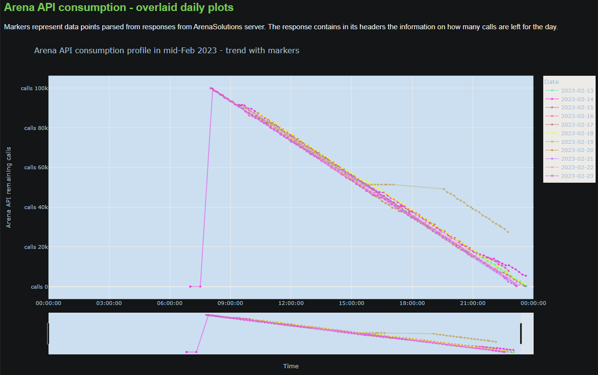
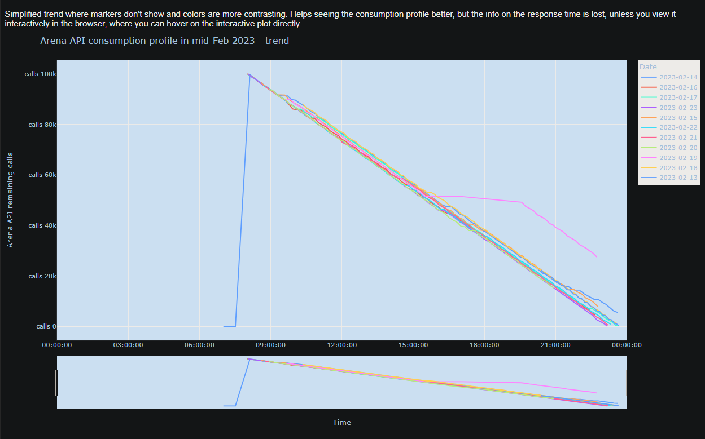

# **Arena REST API monitor**
## **Outline**
customizable monitor to track the activity of a REST API
- based at https://api.arenasolutions.com/v1
- requiring periodical (re-)authentication, using an API key  
- logging the content of response headers, at **repeated regular time intervals**!

- Tried in practice at FAEL - used by Production Engineering
- Allowed to log data points, used to draw consumption trend graphs such as below:

 

To get details on how to use - Original repo README for the generic tool: https://github.com/alicecommits/alices-rest-api-monitor/blob/main/README.md
