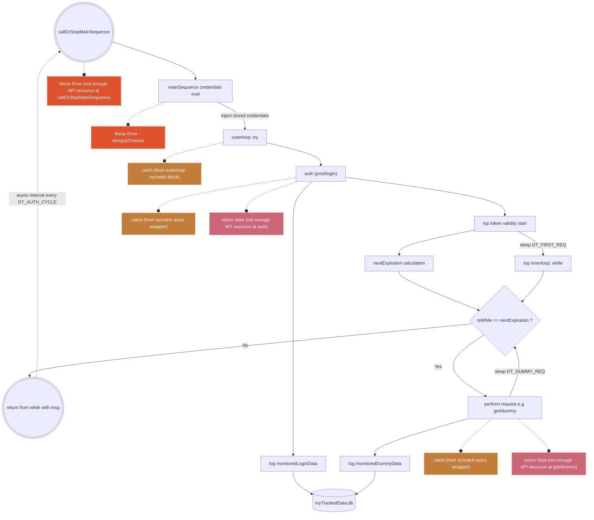

# **Alice's REST API monitor**
## **Outline**
customizable monitor to track the activity of a REST API
- based at a URL https://some-domain.com/api
- requiring periodical (re-)authentication, using an API key  
*this part can be adjusted or removed, depending on your API requiring (or not) authentication*
- logging the content of response status/data/headers, at **repeated regular time intervals**!

## **Stack used**
- Base language: JavaScript (ES6 syntax)
- [**axios**][1]: promise-based HTTP Client for node.js and the browser, supported at the time of first push to this repo (early 2023)
- [**node:readline/promises** + **node:readline/process**][2]: Node.js package to create an interface in the CLI. Used to prompt the user API authentication credentials in this project. Supported in early 2023.
- [**set-interval-async**][3]: Package aiming at replicating JavaScript's in-built `setInterval`, but optimized for a use with asynchronous functions, such as functions written to fetch data from a server.
- [**nedb**][4]: embedded persistent or in memory database for Node.js, nw.js, Electron and browsers, 100% JavaScript, no binary dependency. API is a subset of MongoDB's. In early 2023, the library is however no longer maintained. For now, it serves as an alternative to writing data to a .csv and will be tried as the database tech when the project grows and requires setting up a server for live monitoring purposes, showing dynamically refreshed graphs on the client side.

[1]: https://axios-http.com "axios doc"
[2]: https://nodejs.org/api/readline.html "node.js readline doc"
[3]: https://github.com/ealmansi/set-interval-async "set-interval-async github"
[4]: https://github.com/louischatriot/nedb "NedB github"

## **How to use**
### Conventions used in the documentation:
In what follows we will use the following:
 - *dummyReq(uest)* : refers to the request chosen by the user, after authentication request has been completed successfully (if any needed). A generic example of a `GET/Dummy` request is taken for the code demo.
 - *loginReq(uest)* : refers to the request (http method + endpoint) needed to authenticate (if any needed)
 - *Auth* : abbreviated *Authentication*
 - "top": refers to the instant a timestamp is taken to start a timer, interval, period calculation.
### **In `main.mjs`, set the following**
- **Monitor settings** section:
  - **API general access**
    - *API_URL*: URL of your API (e.g.: https://some-domain.com/api)
    - *API_ENV*: any extra field needed to reach the API (e.g: environment/world/community id...)
  - **API resource handling**
    - *API_CURRENT_RESOURCE*: when setting the value for the first time, set it at least to the maximum resource or rate allowed by your API (e.g: calls/seconds or calls/day, request size/day). Check your REST API doc to know when or how you could maxed out.
    - *MIN_RESOURCE_THRESH*: threshold under which the monitor execution should be stopped. The strategy needs to be set by user, given *API_CURRENT_RESOURCE* above. E.g. when reaching 1000 calls left, stop the monitor.
  - **Request settings > which request are we sending?**  
  This part is to set the request to be sent post-authentication, or right away if no authentication is required. 
    - *HTTP_METHOD*: http method ('get', 'post', etc.)
    - *RESOURCE_TO_FETCH*: the endpoint that contains the data you wish to monitor
    - *DEFAULT_HEADERS*: the headers to send by default at any request to your API. Note: may differ depending on HTTP method/endpoint (e.g: for login, or posting/fetching file content)
  - **Request settings > timeouts (ms)**
    - *LOGIN_REQUEST_TIMEOUT*: if no response, after how many milliseconds the loginRequest is aborted
    - *DUMMY_REQUEST_TIMEOUT*: if no response, after how many milliseconds the dummyRequest is aborted
  - **Response settings: which fields are we interested in?**  
    - *FIELD1_TO_MONITOR* + *FIELD2_TO_MONITOR*: This part is to set the name(s) of the response (data/header/status) fields, that you wish to fetch and log.  
    - Needs to be adjusted alongwith the `monitored...Data` objects defined in the body of `mainSequence`, depending on the JSON path at which the fields of interest are located in the response object: response.data, response.headers, response.status... sometimes a mixture of those.
    - *RESOURCE_KEY*: The field where to find the info on the resource limited by the user via the threshold *MIN_RESOURCE_THRESH*.
    - For more info on how to configure axios response objects, check the doc: https://axios-http.com/docs/res_schema 
  - **Monitor time settings (ms)** - *arbitrary values set in the script*
    - *USER_CREDENTIALS_TIMEOUT*: in case API (re-)authentication is required, when prompted for user credentials, if the user does not input their credentials within *USER_CREDENTIALS_TIMEOUT* duration, and/or the credentials take too long to be reinjected in subsequent monitor runs, then the following Error is thrown: `"user data not input or taking too long to process. Please re-log manually."`, making the monitor quit (see `enterCredentialsOrTimeoutAfter` in `apiUtils.mjs`).
    - **Monitor cycling settings**
      - *DT_FIRST_REQ*: time between auth response and 1st non-login request
      - *DT_DUMMY_REQ*: time between a non-login resp and the next non-login req trigger
      - *DT_AUTH_CYCLE*: time between each (POST/Login + Dummy req) complete cycle 
      - *DT_MONITOR_SESS_AFT_FIRST_RUN*: entire duration of the monitoring session after 1st successful iteration of `mainSequence`. Used to guarantee **the monitor will eventually quit**, either by clearing `setIntervalAsync` with `clearIntervalAsync` at the end of a monitoring session, or with *API_CURRENT_RESOURCE* returning after falling below *MIN_RESOURCE_THRESH*.

    **Important notes regarding monitor cycling settings**
    - ideally *DT_AUTH_CYCLE* should be set = or slightly < to your API token validity period, to limit the frequence of token re-generation
    - if *DT_AUTH_CYCLE* > validity period, you run the risk of sending a non-login request with an invalid token, which will cause an error 401 Unauthorized. To know your API token validity period, check your REST API doc.
    - setting *DT_AUTH_CYCLE* as an exact multiple of *DT_DUMMY_REQ* can cause the latest non-login request to overlap with authentication renewal, which can lead to accidentally send a non-login request with a no longer valid token (error 401 Unauthorized).
    - ideally, *DT_AUTH_CYCLE* should be spaced in time from the latest request, and made a little higher than - but not exactly - the multiple of *DT_DUMMY_REQ*
    - *DT_MONITOR_SESS_AFT_FIRST_RUN* corresponds to how long you want your monitoring session to last. Ideally, should be the longest duration of all.  - e.g. for a 16-hour-long monitoring session, say from 8AM to 11PM : `15(h)*60(min)*60(s)*1000(ms) = 15*60*60*1000`.  
    *Note: DT_MONITOR_SESS_AFT_FIRST_RUN can be set shorter than DT_AUTH_CYCLE safely, but doing this does not present much interest.*
    - **For rationales behind this logics, read the Cycling strategy section below.**

### **(If needed) In `apiUtils.mjs`, tweak the following**
- **`performRequest`**: 
  - `performRequest` is a wrapper function around axios request config. It also console logs the request HTTP METHOD/endpoint + timestamp at request emitting. **The intent in `apiUtils.mjs` is to a template for a typical request configuration**.
  - If the configuration is OK as is for you, and you just need to modify the http method/endpoint, I chose to do it in `main.mjs` directly. If not, then in `apiUtils.mjs > performRequest`, restructure the object contained in `const response = await axios({...})` **#TO DO BLOCK OF CODE**
  - You can also choose to remove http method/endpoint constants from `main.mjs > mainSequence` and hard-code them in `apiUtils.mjs > performRequest`
  - **Parameters of performRequest to be modified by the user of the monitor - see settings in the monitor settings of `main.mjs`**
	 - customHeaders: headers to send to the API (see your REST API documentation if needed)
	 - reqTimeout (ms): request timeout - default is `0` (no timeout)
	 - someData: the data to send in the body of the request.
	someData can only be NON empty for the following http methods (httpVerb):	'PUT', 'POST', 'DELETE', and 'PATCH'
	If not specified, someData is sent as empty body to the REST API (e.g. for a 'GET')
- **Important**: If you're unfamiliar with http requests, before doing anything in `apiUtils.mjs`, it is recommended to check axios documentation for request configuration, notably regarding http methods, authentication, encoding, specific content type: https://axios-http.com/docs/req_config
- **`enterCredentials`**:  
  - The example used in `apiUtils.mjs` is based on a typical situation where, to authenticate to the API, the user would likely need to enter a username/email + a password.
  - If your API works differently, adjust const names/prompt instructions displayed in the CLI.

## **Motivations + Rationales**
### **Cycling strategy**
Going for a monitor cycling schema of the type: authentication request --> "dummy" request 1, dummy request 2, ..., dummy request n was motivated by the following needs and considerations:
- In case the data of interest (e.g. a simple response.status == 200 OK) can be fetched by merely "pinging" the API, using another type of request than the authentication requests themselves allows to limit the frequency at which new tokens are generated.
- enable more complex data tracking, for example, data located at a path in response.data or response.headers
-  **give the user the possibility to adapt the requests**, given their REST API specifications, alongwith the timing strategy - see settings explained above.

### **Exception / Error handling**
The error handling strategy for this monitor was designed with the following in mind:
- Unsuccessful non-authentication requests should not make the monitor stop running, so they shouldn't materialize as unhandled rejection that throws to the CLI, they should be caught
- Empty credentials shouldn't accidentally be sent to the server, otherwise error 401 will occur. To mitigate this, the choice was taken to set a (realistic) limit to the duration available to the user to input their data. If timeout happens, then the monitor quits and the user has to prompt their data again. If the credentials are set but invalidated, error will be thrown as well. **#TODO test invalidation.**
- **The monitor execution should be guaranteed to quit eventually**. The possible scenarios could be a "natural", smooth ending, via termination of the async interval using `clearIntervalAsync`, or an aborted execution due to not enough API resources available, or at least falling under a threshold defined by the user. For the latter, the choice was made to `return false;` at either the auth request point or non-login request point, rather than using `break (outer|inner)loop;`. `return` will stop the execution of `mainSequence` rather than exiting inner/outer loops, which was the prefered behaviour. Once returned from `mainSequence`, the running async interval still needs to be interrupted. For this, the next `callOrStopMainSequence` call will throw an error, which totally quits the monitor execution.  
- **Update 16/05/23**: Detected another case of unclean termination. Sometimes, API rate is high and `429 Too Many Requests` can trigger before the condition `API_CURRENT_RESOURCE) < MIN_RESOURCE_THRESH` is validated and the corresponding case entered. In this case, the `try/catch` structure of `performRequest` in `apiUtils.mjs` applies and so `429 Too Many Requests` is a caught `AxiosError` exception showing in the CLI. A quick correction would be to exclude the catching of `429 Too Many Requests`, throw/return, and "escalate" the return behaviour to totally quit monitor execution.
*Note: the loop keywords `innerloop` and `outerloop`, describing the `try` outer block and `while` inner block respectively, were used in a preliminary version of the code alongwith `break innerloop;` and `break outerloop;`. They were kept for readability only.*

### **Step-by-step execution handling in main**
The design of the final `main` function (IIFE) itself was thought for smooth progression into the monitor looped execution, with rigour:
  1. **For the very 1st monitor execution, `callOrStopMainSequence` is called and awaited.**
     - 1.a. if there aren't enough resources to proceed to more calls, then the error is thrown there.
     - 1.b. if there are, then `STARTING A MAIN SEQUENCE RUN` logs in the CLI and `mainSequence` is awaited, and returned from.
  2. (a) If 1.a. was successful, then `msg = completed_mainSeq_report` must have been returned from it, which conditions 2nd `callOrStopMainSequence` execution. **At that stage, and not before, `setIntervalAsync` is called synchronously with the 2nd call that got fed credentials automatically**. This way, the interval "top" and the credentials input happen almost simultaneously, unlike at the 1st execution, where manual user credential input takes a little longer (and would get the cycle to finish early because started too late w.r.t. interval "top").
     - 2.b: if there is a result returned but it does not evaluate to `false` and it isn't `msg`, then there must be a non-API-resource-related error
     - 2.c: else, not enough API resource error is thrown.  

### **`main` flowchart overview**

Below flowchart represents a high-level overview of the cycling strategy, along with the different steps of error handling

## **Graphing logged data**
An example of (dummy) intermediary static result possible to exploit at that stage - **without the need for a client/server structure just yet** - is available in the **dash-template repo** I've created: https://github.com/alicecommits/dash-template. The data in that repo is purely dummy, generated with random data generators - scripts of which are available in the repo as well, used for demo purposes only. [5]: 

## **TODOs**
- "unhandle" `429 Too Many Requests`, rather than catching it, throwing/returning it, and "escalating" the return behaviour to totally quit monitor execution (see May 23 update in **Exception / Error handling** section above)
- manage node modules --> git ignored for now
- test invalid credentials feature
- try the "module pattern" from MDN doc on IIFE
- password hiding feature in `enterCredentials`
- set a server/client structure to evolve towards a **live monitor + auto-refresh of data logging/graphs**, notably handling the following:
  - CORS
  - neDB database querying
  - Plot refreshing in the browser
  - JS-based interactive plotting, in the browser
